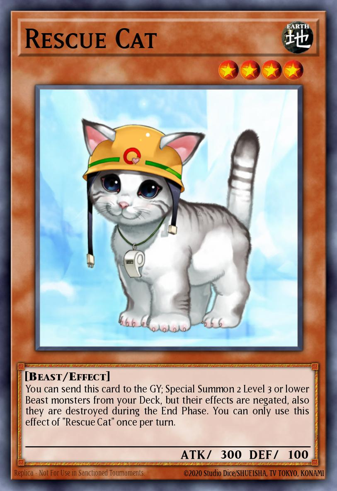

# Super Cats — The Feline Graph Chronicles

Proyecto final del curso de Lenguajes y Compiladores — Universidad EIA.

La aplicación implementa cuatro misiones basadas en grafos y caminos mínimos sobre Java Swing, con una interfaz moderna inspirada en tonos negros, naranjas y blancos, buscando una estética temática de gatos y de la historia del proyecto: Pola, Minerva y Limon.

## Integrantes del grupo

- Carlos Mauricio Velasco Chavarro
- Santiago Perez
- Pablo Escudero

## Estado actual del proyecto

El proyecto ya tiene una interfaz gráfica funcional en `src/gui/MainFrame.java`, con estas funcionalidades principales:

- pestañas para las 4 misiones,
- carga de ejemplos por misión,
- entrada personalizada del usuario,
- ejecución del algoritmo y presentación del resultado,
- vista previa visual del grafo o la grilla,
- mini pantalla de evolución para observar cómo se construyen los caminos o recorridos paso a paso,
- tema visual oscuro con paleta negra/naranja/blanca y componentes personalizados.

La GUI cumple con la idea de poder probar casos de prueba incluidos y entradas personalizadas, además de mostrar varios grafos y mapas en una pequeña pantalla de evolución visual.

## Cómo compilar y ejecutar

La forma recomendada es abrir el proyecto en IntelliJ IDEA y ejecutar la clase:

- `gui.MainFrame`

También puede ejecutarse desde la línea de comandos si se compila el proyecto Java completo, por ejemplo desde la raíz del repositorio:

```bash
javac -d out $(find src -name "*.java")
java -cp out gui.MainFrame
```

En Windows, si se usa un entorno de consola, la opción más fiable es compilar desde el IDE o desde una terminal con Java configurado correctamente.

## Estructura del proyecto

```text
src/
├── algorithms/
│   ├── mission1/       BFSDFSSolver.java, PathResult.java
│   ├── mission2/       Dijkstra.java, DijkstraResult.java
│   ├── mission3/       BellmanFord.java, FloydWarshall.java, Mission3Solver.java
│   └── mission4/       Kruskal.java, Union.java
├── Exceptions/
│   ├── EEntradaInvalida.java
│   ├── EFueraRango.java
│   └── ENumeroNegativo.java
├── gui/
│   └── MainFrame.java
├── io/
│   ├── Input.java
│   ├── MisionUnoCaso.java
│   ├── MisionDosCaso.java
│   ├── MisionTresCaso.java
│   ├── Output.java
│   └── ...
├── model/
│   ├── Edge.java
│   ├── Graph.java
│   ├── Grid.java
│   ├── Punto.java
│   └── WeightedEdge.java
├── test/
│   ├── BFS_DFS_TEST.java
│   ├── DIJKSTRA_TEST.java
│   ├── FLOYDWARSHALL_BELLMANFORD_TEST.java
│   └── KRUSKAL_TEST.java
└── images/
    └── rescuecat.jpg
```

## Misión 1: BFS / DFS sobre grilla

La misión 1 se resuelve con `BFSDFSSolver` y `PathResult`.

- Implementa búsqueda en amplitud (BFS) y profundidad (DFS).
- Maneja una grilla con bombas.
- Se evita recursion profunda en DFS para soportar grillas grandes sin `StackOverflowError`.
- El orden de vecinos se mantiene fijo para asegurar resultados deterministas.
- La salida se integra con `io.Input` y `io.Output` y se presenta en la GUI.

## Misión 2: Dijkstra

La misión 2 calcula rutas mínimas con pesos no negativos.

- Se usa la estructura genérica `Graph`.
- `DijkstraResult` guarda el camino encontrado y su costo total.
- La GUI permite cargar ejemplos y visualizar el camino resultante en el grafo.

## Misión 3: Floyd-Warshall y Bellman-Ford

La misión 3 resuelve los casos de rutas entre todos los pares y la detección de ciclos negativos.

- `FloydWarshall` calcula distancias mínimas entre cualquier par de nodos.
- `BellmanFord` detecta ciclos negativos y valida relajar caminos.
- `Mission3Solver` centraliza la resolución según la entrada.

## Misión 4: Kruskal

La misión 4 implementa el árbol de expansión mínima con `Kruskal` y `Union`.

- Ordena las aristas por peso.
- Selecciona las aristas válidas sin formar ciclos.
- Produce el resultado final en formato legible para la GUI.

## Componentes clave del proyecto

### `model.Graph`
Es el modelo común para las misiones 2, 3 y 4.

Mantiene:

- lista de adyacencia para recorridos por nodos,
- estructura de aristas planas para algoritmos globales,
- soporte a grafos dirigidos y no dirigidos.

### `model.Grid` y `model.Punto`
Representan la grilla de la misión 1.

- `Grid` guarda dimensiones y celdas con bombas.
- `Punto` encapsula coordenadas `(fila, columna)`.
- Esto ayuda a representar mapa, inicio, destino y recorrido sin duplicar lógica.

### `io.Input` y `io.Output`
Son el canal de entrada y salida del sistema.

- `Input` lee texto, valida formato y genera casos de prueba.
- `Output` formatea los resultados para consola o GUI.
- La misma estructura se reutiliza entre misiones para mantener consistencia.

### `gui.MainFrame`
Es la pieza más visible del proyecto.

Incluye:

- 4 pestañas de misión,
- panel de entrada para probar casos personalizados,
- panel de salida para ver resultados,
- `GraphPreviewPanel` para visualizar el estado del problema,
- animaciones de recorrido o relajación según la misión,
- tema visual oscuro con esquema negro/orange/blanco.

## Tests del proyecto

En `src/test` hay pruebas de referencia para cada algoritmo principal:

- `BFS_DFS_TEST.java`
- `DIJKSTRA_TEST.java`
- `FLOYDWARSHALL_BELLMANFORD_TEST.java`
- `KRUSKAL_TEST.java`

Estos tests validan el comportamiento correcto de los algoritmos y sirven como referencia durante la ejecución y la evaluación del proyecto.

## Cambios recientes incorporados

- Se actualizó la interfaz a un diseño oscuro y más pulido.
- Se agregaron botones para cargar ejemplo, ejecutar y limpiar.
- Se habilitó la visualización de casos personalizados por misión.
- Se integró una mini pantalla de evolución para observar la construcción visual del problema.
- Se mejoró la experiencia general del usuario en la GUI, manteniendo la estética de gato y la identidad del proyecto.
- La aplicación ya no es solo una herramienta de consola: ahora funciona como una interfaz gráfica completa para validar algoritmos.

## Recomendación de uso

Para probar la solución, se recomienda:

1. Seleccionar una misión.
2. Cargar el ejemplo del sistema o escribir una entrada personalizada.
3. Ejecutar la misión.
4. Revisar la salida y la vista previa del mapa o grafo.
5. Usar la mini pantalla para comprender cómo avanza la exploración o el cálculo del algoritmo.

## Referecia de Carlitos :)


